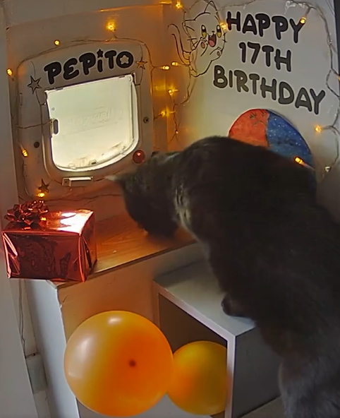

# Pépito C++ program




## Here is one of Pépito's official accounts:
https://x.com/PepitoTheCat 


# The program

This is a multi-threaded C++ program that listens to Server-Sent Events (SSE) and prints the messages to the console.
All messages are parsed, and the program serves as an example of how to parse SSE messages in C++.

Using this code as the base, you can extend it to do whatever you want with the messages. 

The program is using the [Pépito API]( 
https://github.com/Clement87/Pepito-API/tree/main?tab=readme-ov-file#p%C3%A9pito-api) to get the messages.

For example you could:
- When Pépito goes in or out of the house 
    - Connect to all Philips Hue bridges on your network and flash the lights when a particular message is received.
    - Use your imagination and do something fun with the messages.


## Pre-requisites
```bash
# Arch Linux
pacman -S meson nlohmann-json base-devel
```

## How to build

VSCode press F5 to build and run the program.

```bash
# Build the program
clear && meson setup build --buildtype=debug && cd build && ninja && cd ..

# Run the program
./build/pepito_app
```


## License
MIT License
